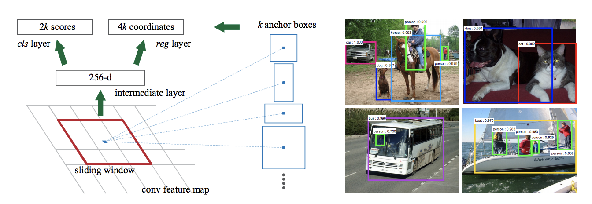
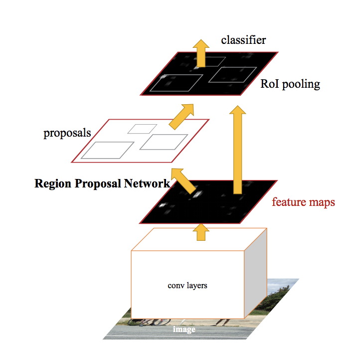
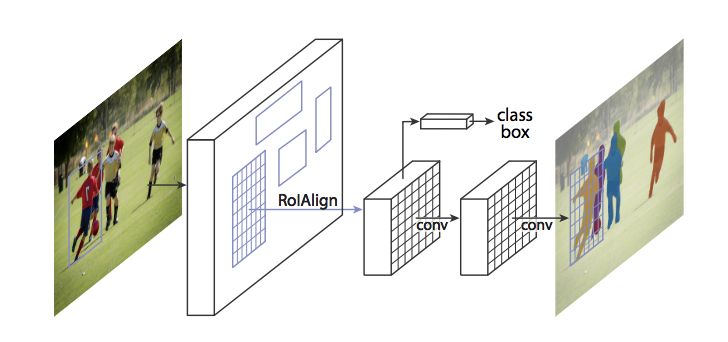
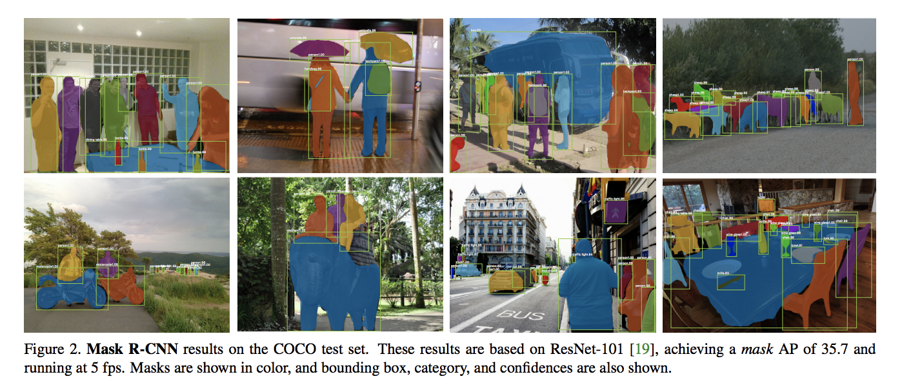

# AI-Team-5
# Project building architecture combining R-CNN network in Faster R-CNN paper and Facenet using Python
___
## Introduction
we propose what point affect to accuracy from between Python Package and C raw programming without Package.

## Requirements

- Previous Code Analytics from other git-repository about FRCNN,MRCNN
- Build unique RCNN Network for mobile computing environment
- python 3.x

## Datasets
Imagenet 

### Train Image Dataset
- download dataset from this [link](http://www.image-net.org) and put it in this project

### Test Image Dataset
The test image dataset are sampled from this [link](http://www.image-net.org) and put ti in this project

## TODO
* Reading Papers(R-CNN, Fast R-CNN, Faster R-CNN, FaceNet) and Studying
* Analyze existing code from github "https://github.com/jooyounghun/tensorpack/tree/master/examples/FasterRCNN"
* Build RCNN architecture

## DONE
* "FaceNet: A Unified Embedding for Face Recognition and Clustering" [Paper](https://arxiv.org/pdf/1503.03832) 
* "Faster R-CNN: Towards Real-Time Object Detection with Region Proposal Networks" [Paper](https://arxiv.org/pdf/1506.01497)
* "Mask R-CNN" [Paper](https://arxiv.org/abs/1703.06870)

> Architecture of Network(Faster R-CNN & Mask R-CNN)

 ** Faster-RCNN **

- Architecture
<table>
  <tr>
    <td>
     
    </td>
  </tr>
</table>

- Sample View
<table>
  <tr>
    <td>
      
    </td>
  </tr>
</table>
  
  
 ** Mast-RCNN **

- Architecture
<table>
  <tr>
    <td>
     
    </td>
  </tr>
</table>

- Sample View
<table>
  <tr>
    <td>
      
    </td>
  </tr>
</table>

## Reference
- Florian Schroff, Dmitry Kalenichenko, James Philbin. Google Inc. FaceNet: A Unified Embedding for Face Recognition and Clustering. arXiv:1503.03832, 2015
- Shaoqing Ren, Kaiming He, Ross Girshick, and Jian Sun. Faster R-CNN: Towards Real-Time Object
Detection with Region Proposal Networks. arXiv:1506.01497, 2016
- Kaiming He Georgia Gkioxari Piotr Dollar Ross Girshick. Facebook AI Research (FAIR). Mask R-CNN. arXiv:1703.06870, 2018
